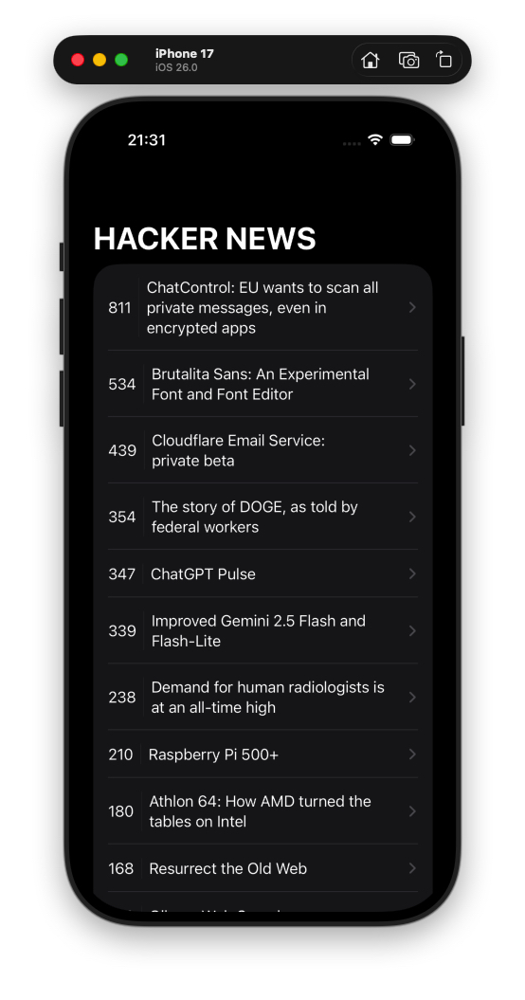
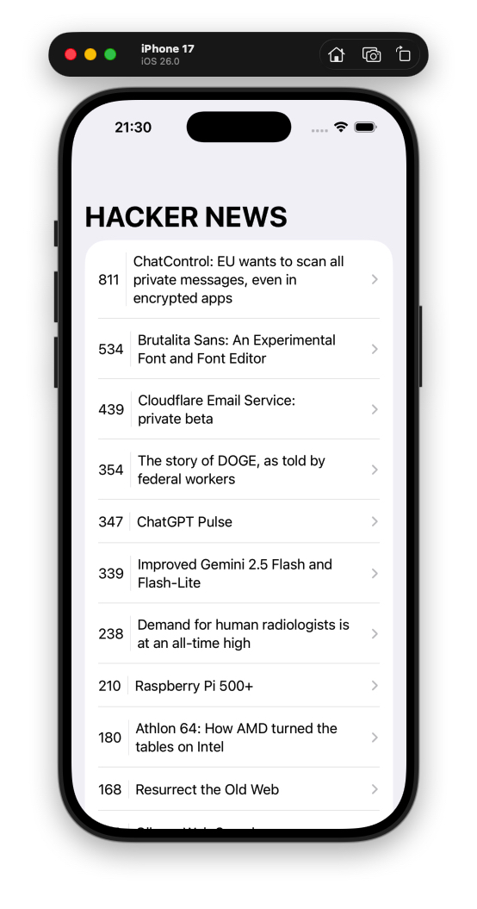
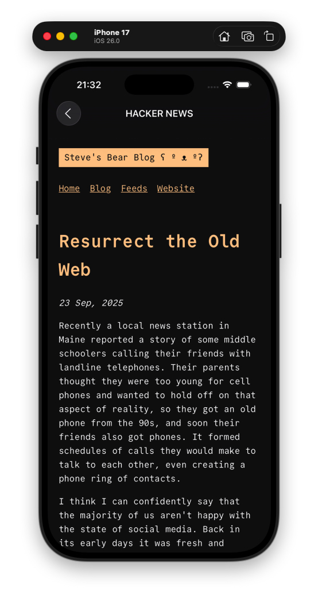

# Hacker News 📱💬

| Dark Theme          | Light Theme          | WebView            |
|---------------------|----------------------|--------------------|
|  |  |  |

**SwiftUI + MVC + async/await**

Hacker News app.

## ✨ Features
- Show Hacker News posts
- You can read the post in the web view

## 🧱 Architecture
- **MVC** (Model → View → Controller)
- **Layers**: `Models`, `Views`, `Controllers`

## 🛠️ Stack
Swift 6.2 • SwiftUI • Combine • Xcode 26 • iOS 26

## 🚀 How to Run
1. `git clone https://github.com/Luizgustavo358/iOS-Swift-Course.git`
2. Open `apps/HackerNews/HackerNews.xcodeproj`
4. Run in iPhone 17

## Course Link

- [iOS & Swift - The Complete iOS App Development Bootcamp](https://www.udemy.com/course/ios-13-app-development-bootcamp/?couponCode=MT250923G3)

## Made by:

- [Luiz Gustavo Bragança dos Santos](https://github.com/Luizgustavo358)

## 📸 Screenshots

| Dark Theme          | Light Theme          | WebView            |
|---------------------|----------------------|--------------------|
|  |  |  |

---

## 🗺️ Roadmap
- [X] Light/Dark Mode
- [ ] Widget
- [ ] Testes UI (XCTest)

## 📄 Licença
MIT